## 📖 Overview

Proyek ini merupakan sistem deteksi dan pembacaan plat nomor kendaraan berbasis Deep Learning menggunakan model YOLO. Sistem bekerja dalam dua tahap, yaitu mendeteksi lokasi plat nomor pada kendaraan, kemudian mendeteksi setiap karakter pada plat nomor menggunakan model YOLO yang telah dilatih secara khusus.

Model deteksi plat nomor dibandingkan menggunakan tiga arsitektur, yaitu **YOLOv5s**, **YOLOv8s**, dan **YOLOv11s** untuk mengevaluasi performa berdasarkan metrik Precision, Recall, F1-Score, dan mAP@0.5. Selanjutnya, hasil deteksi plat nomor diproses oleh model YOLOv11s karakter untuk menghasilkan susunan karakter plat nomor secara otomatis.

## 📂 Dataset

Pada proyek ini digunakan dua dataset yang berbeda, yaitu dataset untuk **deteksi plat nomor kendaraan** dan dataset untuk **deteksi karakter plat nomor**.

### Dataset Deteksi Plat Nomor

Dataset deteksi plat nomor dikumpulkan secara langsung di wilayah Kota Bima dan telah melalui proses anotasi menggunakan Roboflow. Dataset ini terdiri dari **2.000 citra** dengan dua objek utama yang dideteksi, yaitu **plat nomor** dan **kendaraan**. Objek kendaraan terdiri dari empat jenis, yaitu **sepeda motor**, **mobil**, **truk**, dan **bus**.

#### Kelas Dataset

| Kelas | Deskripsi |
|--------|-----------|
| Plat Nomor | Area plat nomor kendaraan |
| Kendaraan | Terdiri dari sepeda motor, mobil, truk, dan bus |

#### Jumlah Dataset

- Total Data : **2.000 citra**

#### Pembagian Dataset

| Dataset | Persentase |
|----------|-----------:|
| Training | 70% |
| Validation | 20% |
| Testing | 10% |

### Dataset Deteksi Karakter

Dataset deteksi karakter digunakan untuk melatih model YOLOv11s agar mampu mengenali setiap karakter pada plat nomor kendaraan. Dataset ini diperoleh dari hasil *cropping* plat nomor, kemudian setiap huruf dan angka dianotasi menggunakan Roboflow.

Dataset terdiri dari **4.167 citra** dengan **36 kelas karakter**, yaitu huruf **A–Z** dan angka **0–9**.

#### Jumlah Dataset

- Total Data : **4.167 citra**

#### Pembagian Dataset

| Dataset | Persentase |
|----------|-----------:|
| Training | 80% |
| Validation | 10% |
| Testing | 10% |

## ⚙️ Konfigurasi Pelatihan

### Model Deteksi Plat Nomor

| Parameter | Nilai |
|-----------|--------|
| Model | YOLOv5s, YOLOv8s, YOLOv11s |
| Optimizer | SGD |
| Learning Rate | 0.01 |
| Batch Size | 16 |
| Epoch | 40 |
| Image Size | 832 × 832 |
| Platform | Google Colab (GPU NVIDIA Tesla T4) |

### Model Deteksi Karakter

| Parameter | Nilai |
|-----------|--------|
| Model | YOLOv11s |
| Optimizer | SGD |
| Learning Rate | 0.01 |
| Batch Size | 16 |
| Epoch | 40 |
| Image Size | 832 × 832 |
| Platform | Google Colab (GPU NVIDIA Tesla T4) |

## 📊 Hasil Pelatihan

Model YOLOv5s, YOLOv8s, dan YOLOv11s dilatih menggunakan konfigurasi parameter yang sama selama 40 epoch. Berikut merupakan hasil pelatihan dari masing-masing model.

### YOLOv5s

#### Hasil Pelatihan

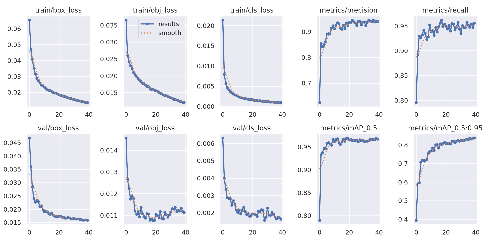

#### Kurva Evaluasi

| Precision | Recall |
|-----------|--------|
| 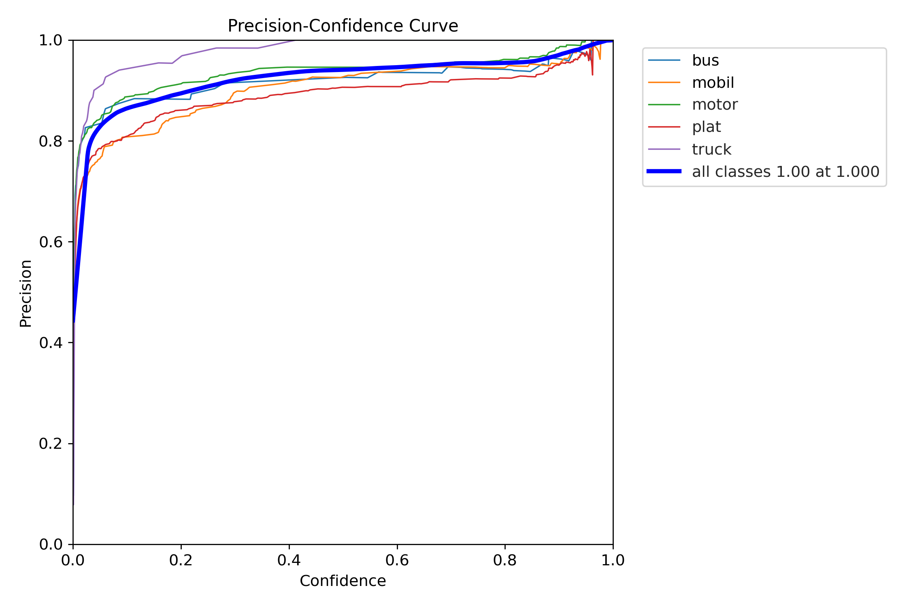 | 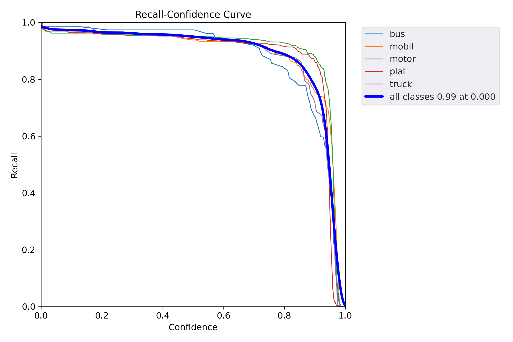 |

| F1-Score |
|-----------|
| 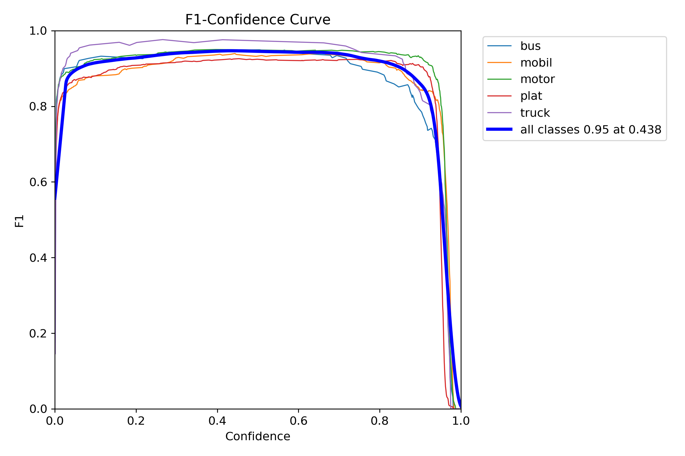 |

---

### YOLOv8s

#### Hasil Pelatihan

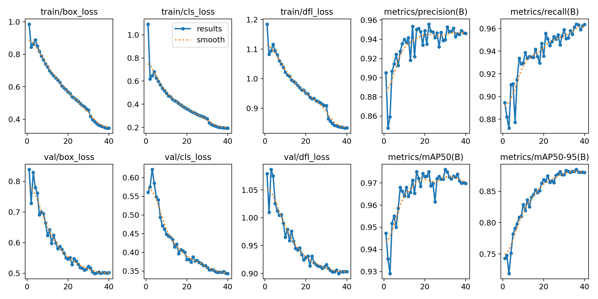

#### Kurva Evaluasi

| Precision | Recall |
|-----------|--------|
| 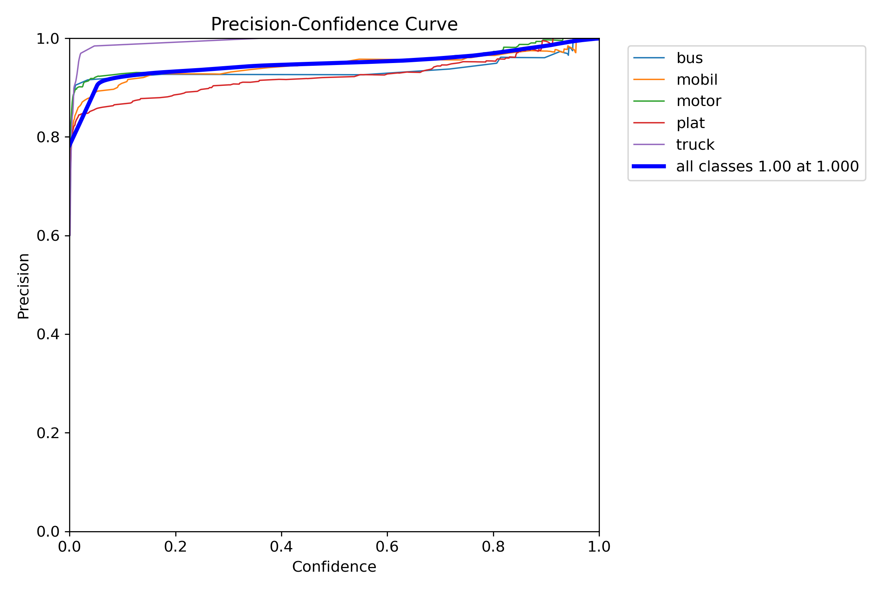 | 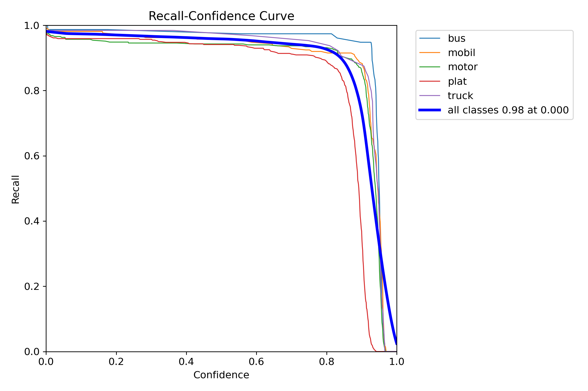 |

| F1-Score |
|-----------|
| 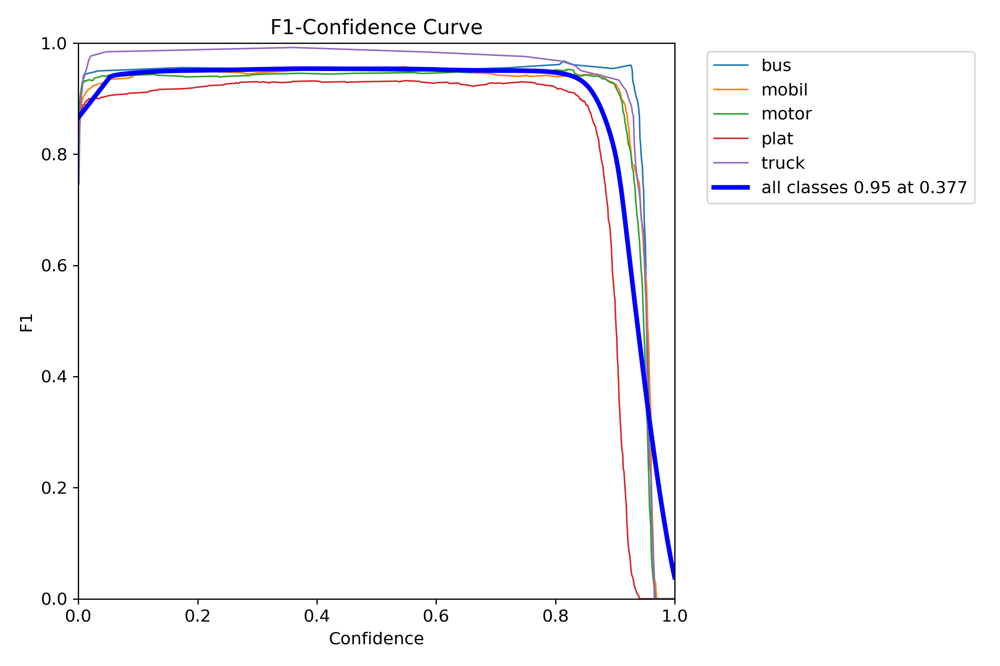 |

---

### YOLOv11s

#### Hasil Pelatihan

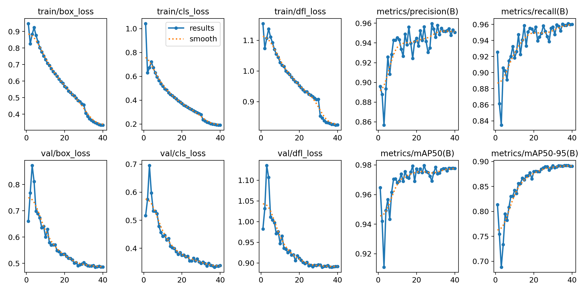

#### Kurva Evaluasi

| Precision | Recall |
|-----------|--------|
| 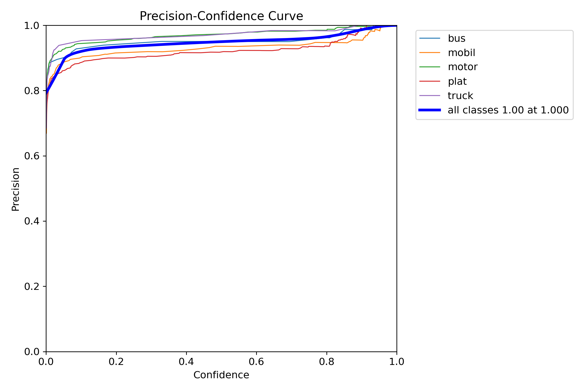 | 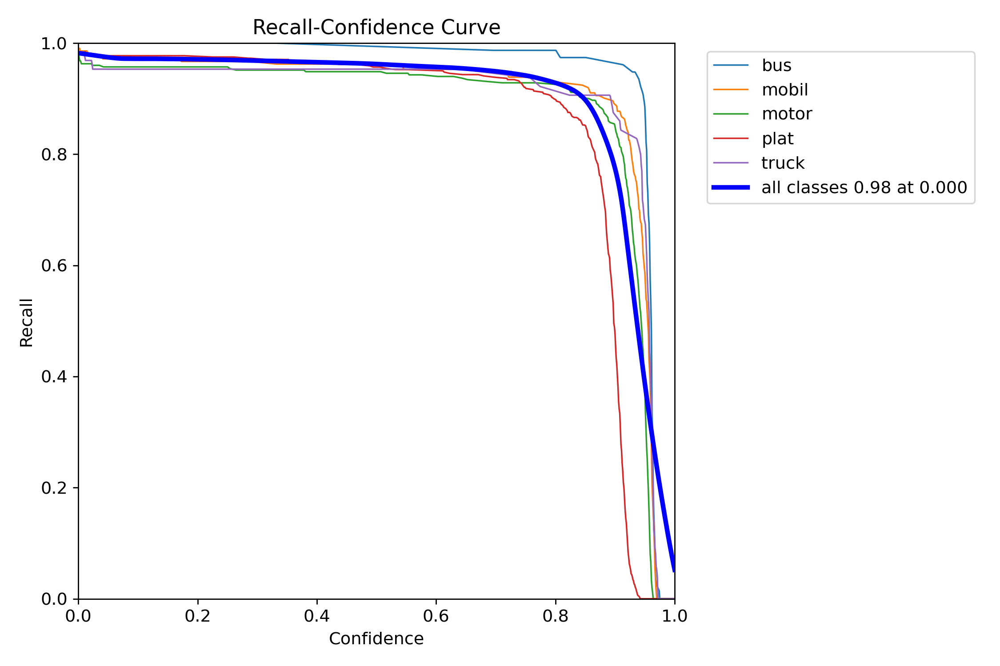 |

| F1-Score |
|-----------|
| 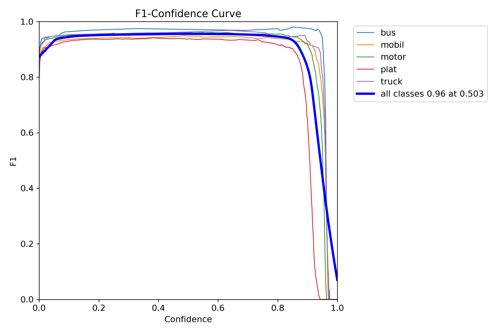 |

## 📋 Perbandingan Performa Model

Tabel berikut menunjukkan hasil evaluasi ketiga model berdasarkan metrik **Precision**, **Recall**, **F1-Score**, **mAP@0.5**, dan **mAP@0.5:0.95**.

| Model | Precision | Recall | F1-Score | mAP@0.5 | mAP@0.5:0.95 |
|:------:|:---------:|:------:|:--------:|:-------:|:------------:|
| **YOLOv5s** | **0.920** | **0.950** | **0.950** | **0.967** | **0.830** |
| **YOLOv8s** | **0.940** | **0.960** | **0.950** | **0.974** | **0.870** |
| **YOLOv11s** | **0.950** | **0.960** | **0.960** | **0.978** | **0.890** |

### Model Deteksi Karakter (YOLOv11s)

Model deteksi karakter menggunakan **YOLOv11s** yang dilatih pada dataset berisi **4.167 citra** dengan **36 kelas karakter**, yaitu huruf **A–Z** dan angka **0–9**. Model ini bertugas mendeteksi setiap karakter pada plat nomor hasil *cropping* dari tahap deteksi plat nomor.

#### Hasil Pelatihan

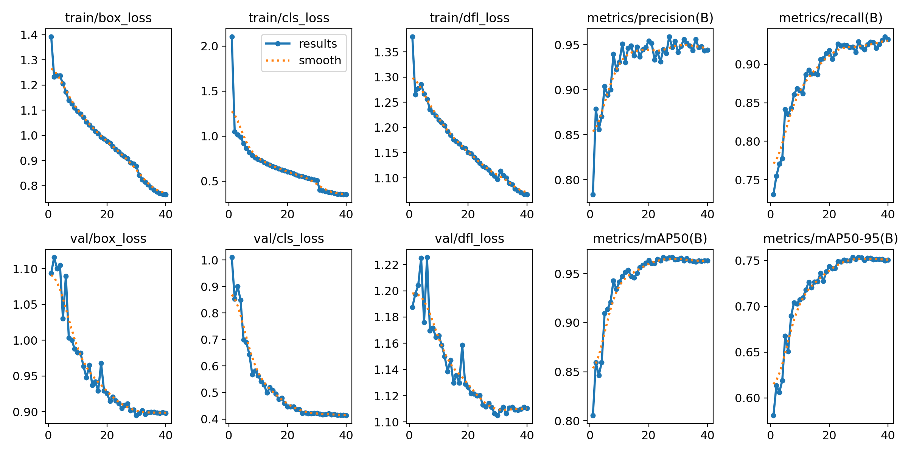

## 🎯 Hasil Implementasi

###

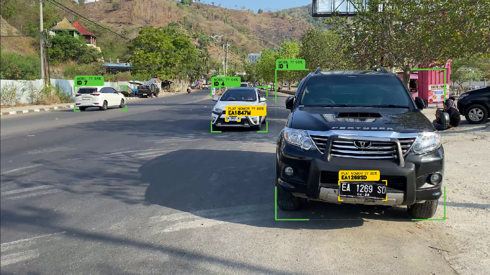

---

###

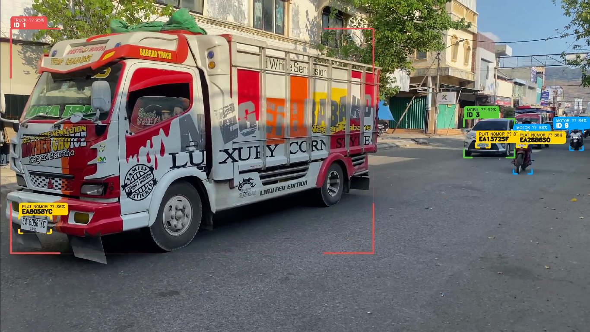

---

###

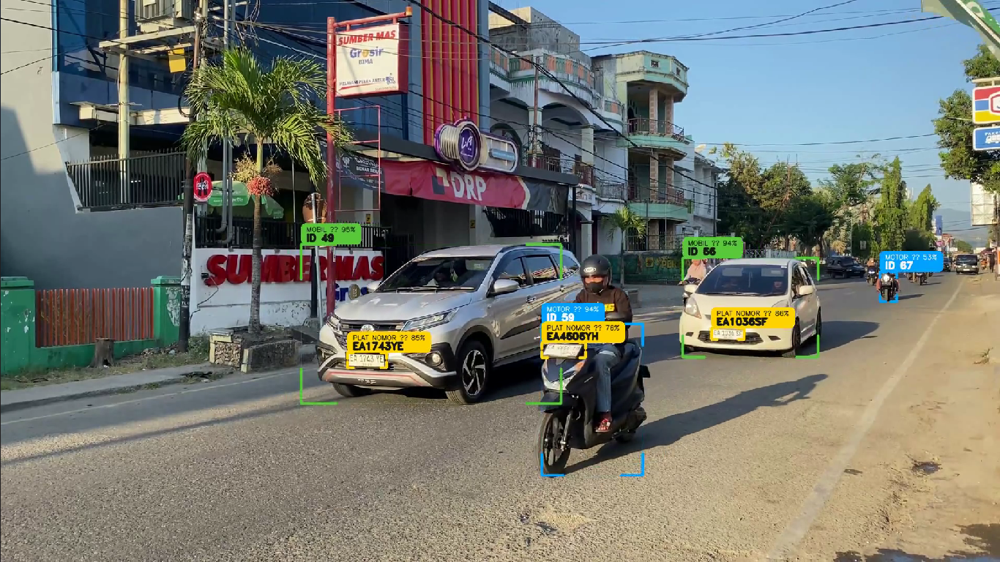
